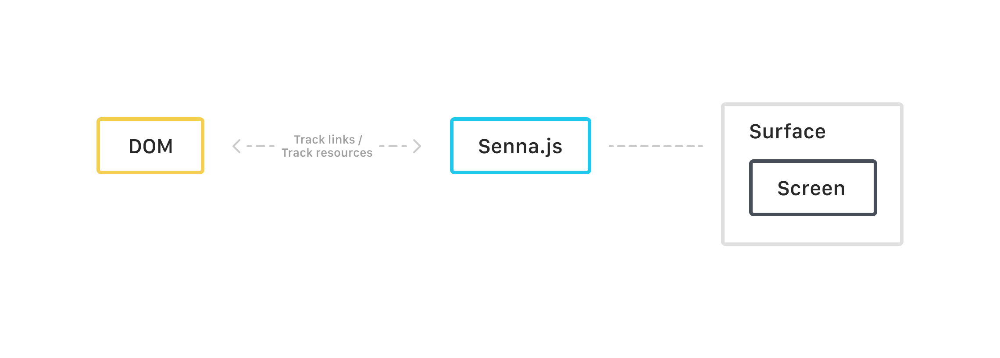
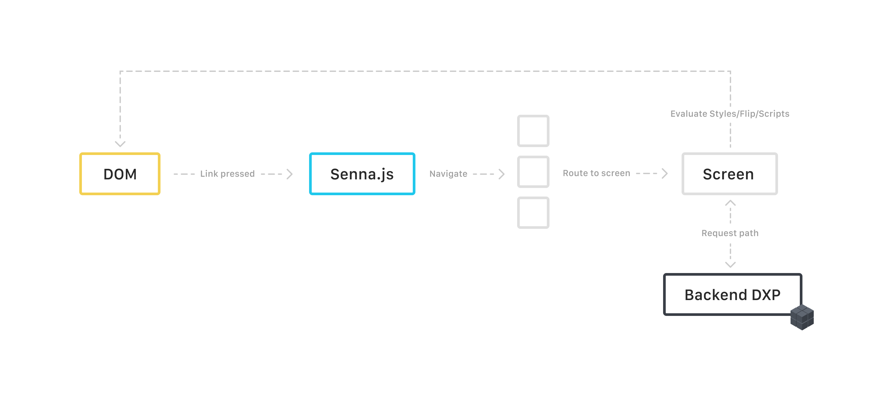
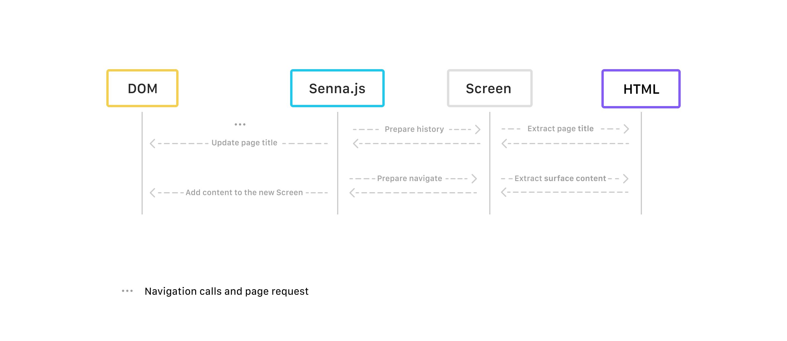
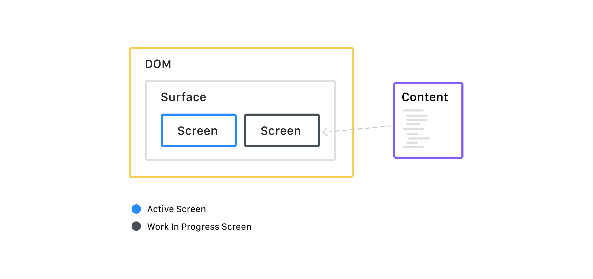

> :warning: The contents of this repo have been migrated [to the `liferay/liferay-frontend-projects` monorepo](https://github.com/liferay/liferay-frontend-projects) and more specifically to the [to the `guidelines/` directory](https://github.com/liferay/liferay-frontend-projects/tree/master/guidelines). Maintenance will continue there, and this repo will be archived (ie. switched to read-only mode). Depending on whether files have moved in the new repo, you may be able to see the current version of this page at [this location](https://github.com/liferay/liferay-frontend-projects/tree/master/guidelines/dxp/sennajs_integration.md).

# Senna.js integration in DXP

This article describes how [Senna.js](https://github.com/liferay/senna.js) is integrated in DXP and how it works under the hood.

### Introduction

The infrastructure around Senna.js is located in the [`frontend-js-spa-web`](https://github.com/liferay/liferay-portal/tree/2d4120b7fdb8cf03e7505ebdaacee3bdceec3391/modules/apps/frontend-js/frontend-js-spa-web) module.

In this module, a Senna.js [`App`](https://github.com/liferay/senna.js/blob/059022b737de0f0108b7ef3f06f14d7ade3baa94/src/app/App.js) instance is created, with two routes which are handled by a specific [`Screen`](https://github.com/liferay/senna.js/blob/059022b737de0f0108b7ef3f06f14d7ade3baa94/src/screen/Screen.js) instance.

-   The [`ActionURLScreen`](https://github.com/liferay/liferay-portal/blob/2d4120b7fdb8cf03e7505ebdaacee3bdceec3391/modules/apps/frontend-js/frontend-js-spa-web/src/main/resources/META-INF/resources/liferay/screen/ActionURLScreen.es.js) class is used for all requests made to "action" URLs, which are used to post forms. It makes sure that the http method used is `POST` and checks that the `p_p_lifecycle` URL parameter has the correct value (which is `0`) when submitting a form.

-   The [`RenderURLScreen`](https://github.com/liferay/liferay-portal/blob/2d4120b7fdb8cf03e7505ebdaacee3bdceec3391/modules/apps/frontend-js/frontend-js-spa-web/src/main/resources/META-INF/resources/liferay/screen/RenderURLScreen.es.js) class is used for all "render" URLs, which return content, and is set to cacheable.

Both of these classes inherit from the [`EventScreen`](https://github.com/liferay/liferay-portal/blob/2d4120b7fdb8cf03e7505ebdaacee3bdceec3391/modules/apps/frontend-js/frontend-js-spa-web/src/main/resources/META-INF/resources/liferay/screen/EventScreen.es.js) class which adds specific behaviour on top of Senna.js's [`Screen`](https://github.com/liferay/senna.js/blob/059022b737de0f0108b7ef3f06f14d7ade3baa94/src/screen/Screen.js) class such as dispatching events during the screen's lifecycle (loading, activated, disposed) or managing the cache.

The Senna.js `App` instance is exposed through the global variable [`Liferay.SPA.app`](https://github.com/liferay/liferay-portal/blob/2d4120b7fdb8cf03e7505ebdaacee3bdceec3391/modules/apps/frontend-js/frontend-js-spa-web/src/main/resources/META-INF/resources/liferay/init.es.js#L129).

The `frontend-js-spa-web` module also contains templates to [configure](https://github.com/liferay/liferay-portal/blob/2d4120b7fdb8cf03e7505ebdaacee3bdceec3391/modules/apps/frontend-js/frontend-js-spa-web/src/main/resources/META-INF/resources/config.tmpl) and [initialize](https://github.com/liferay/liferay-portal/blob/2d4120b7fdb8cf03e7505ebdaacee3bdceec3391/modules/apps/frontend-js/frontend-js-spa-web/src/main/resources/META-INF/resources/init.tmpl) the senna.js `App`.

Everything is included with the [`SPATopHeadJSPDynamicInclude`](https://github.com/liferay/liferay-portal/blob/2d4120b7fdb8cf03e7505ebdaacee3bdceec3391/modules/apps/frontend-js/frontend-js-spa-web/src/main/java/com/liferay/frontend/js/spa/web/internal/servlet/taglib/SPATopHeadJSPDynamicInclude.java#L134-L143) if DXP is configured to use SPA, which it is by default (except in [Internet Explorer](https://github.com/liferay/liferay-portal/blob/454d7f6a439dc668a0ce0529cff2cae87ee9a0d5/modules/apps/frontend-js/frontend-js-spa-web/src/main/java/com/liferay/frontend/js/spa/web/internal/configuration/SPAConfiguration.java#L38-L50)).

Disabling SPA in DXP can be done by setting adding the `javascript.single.page.application.enabled=false` key/value pair to your `portal-ext.properties` file.
Additionally, if you want to enable Single Application Mode for Internet Explorer, you can do so by navigating to: **Control Panel** > **System Settings** > **Infrastructure** > **Frontend SPA Infrastructure** and unchecking the checkboxes for Internet Explorer, but keep in mind that this might change in the future and that it is not recommended.

## Link selectors

By default, the Senna.js `App` instance will handle all click events on links (`<a>` tags), that match the CSS selectors specified in the `Liferay.SPA.navigationExceptionSelectors` global variable.

These CSS selectors can also be configured by navigating to **Control Panel** > **System Settings** > **Infrastructure** > **Frontend SPA Infrastructure** and changing the values specificed in the **Navigation Exception Selectors** fields.

## Form submission

The form submission will also be handled by the Senna.js `App` instance, unless the form's `action` attribute is set to `get`

## Block list

It's also possible to tell the Senna.js `App` instance which portlets it needs to ignore, in which case it will not be used for navigation or form submission.

Any portlet that is set to not use "Single Application Mode", or any portlet that is not deployed (and not ready) is automatically added to this list.

To disable single application mode in your portlet, you can follow these steps:

-   Open your portlet class.

-   Set the com.liferay.portlet.single-page-application property to false:

    ```properties
    com.liferay.portlet.single-page-application=false
    ```

    If you prefer, you can set this property to `false` in your `liferay-portlet.xml` instead by adding the following property to the `<portlet>` section:

    ```xml
    <single-page-application>false</single-page-application>
    ```

        Alternatively, you can override the `isSinglePageApplication` method of the portlet to return false.

## Cache

The Senna.js `App` will use caching, if the `Liferay.SPA.cacheExpirationTime` variable's value is greater than `0`.
By default DXP sets this value to `-1` which means that the cache is disabled, if you want Senna.js cache to never be cleared you can set this value to `0`
or specify the value (in minutes) after when Senna.js cache should be cleared.

The cache expiration time can also be configured by navigating to **Control Panel** > **System Settings** > **Infrastructure** > **Frontend SPA Infrastructure** and changing the value specified in the **Cache Expiration Time** field.

With caching enabled, once a resource is loaded, it's content is cached in memory and is retrieved later on without any additional request.

## Excluded paths

The `frontend-js-spa-web` module also introduces a property called [`spa.excluded.paths`](https://github.com/liferay/liferay-portal/blob/454d7f6a439dc668a0ce0529cff2cae87ee9a0d5/modules/apps/frontend-js/frontend-js-spa-web/src/main/resources/spa.properties) which, as its name indicates, is a list of paths that should be ignored by the `Senna.js` App instance.

These paths, are visible in the global `Liferay.SPA.excludedPaths` variable.

## URLs

By default Senna.js in DXP will contain the required parameters needed by portlets, specifically `p_p_id`, `p_p_lifecycle`, `p_p_state` and `p_p_auth`.

## Events

By default, Senna.js dispatches some events during the navigation process that can be used to remove elements or to destroy events from the page application, in DXP the events are dispatched/emitted via `Liferay.on`.

-   `beforeNavigate`
    Dispatched before navigation starts

-   `startNavigate`
    Dispatched when navigation begins

-   `screenLoad`
    Dispatched when the screen's content is loaded

-   `beforeScreenFlip`
    Dispatched before a screen is visible

-   `screenFlip`
    Dispatched when the screen is visible

-   `screenActivate`
    Dispatched when a screen is visible and active, allows a screen to perform any setup that requires it's DOM to be visible.

-   `endNavigate`
    Dispatched after the content has been retrieved and inserted onto the page

-   `screenDeactivate`
    Dispatched after a screen is deactivated, and allows doing any cleanup, for example stopping timers

-   `screenDispose`
    Dispatched when a screen is removed

The destroy of DXP portlets are triggered by the `beforeScreenFlip` event.

## How Senna.js works



Senna.js, introduces the following concepts:

-   **Routes** Determine which path will be controlled by Senna.js and which Screen will handle the content.
-   **Surface** A DOM element with an `id` attribute, which is where the content will be rendered.
-   **Screen** A special type of route handler to handle the navigation request.

To simulate a single page application, Senna.js [tracks all links](https://github.com/liferay/senna.js/blob/059022b737de0f0108b7ef3f06f14d7ade3baa94/src/app/App.js#L104) within the Surface. When a link is triggered, Senna.js controls the event by preventing the default behavior to prevent navigation from being made by the browser and then triggers the navigation process.

### Navigation



When navigation is made by Senna.js it creates a Screen and creates an element in the DOM next to the active Screen where the Screen can render the elements of the next route.

1. Identifies whether the path satisfies any route
2. Invoke the Screen that handles this route
3. Prepares the surface and sequentially calls the life cycle of a Screen
    - `load`
    - `getTitle`
    - `beforeUpdateHistoryPath`
    - `beforeUpdateHistoryState`
    - `getSurfaceContent`
    - `evaluateStyles`
    - `flip`
    - `evaluateScripts`
4. Synchronizes the scroll position if necessary
5. Finalize navigation
    - Activate screen
    - Caches the Screen in memory

The Screen can control the entire loading and extraction cycle of content resources to allocate in the DOM. [`HtmlScreen`](https://github.com/liferay/senna.js/blob/master/src/screen/HtmlScreen.js) is responsible for a good part of the manipulation and extraction of information from the content of the request and extends [`RequestScreen`](https://github.com/liferay/senna.js/blob/master/src/screen/RequestScreen.js) that takes care of setting up the request of the requested path.

```
HtmlScreen -> RequestScreen -> Screen
```

When the load happens all the returned content is allocated in a virtual document, Screen does not add directly to the DOM to not cause problems and for a better experience during the transition, the transition to the page is done only when everything is ready (style, scripts, and elements).



The content returned from the request will be the complete page that would be returned when navigation was not done via the SPA. Senna.js requests the information for the Screen that it extracts from the virtual document that is created during the `load` process and is added to the DOM later.

-   Extract the page title
-   Extract surface content
-   Extract resources (style, link and script)

Resources that are not inside the request's Surface and do not contain the tracking attribute are ignored as well as elements that may be outside the Surface in `body`, for the case of DXP it is considered [only a single Surface which is `body`](https://github.com/liferay/liferay-portal/blob/8ba97db5d9cac893f46425134b84295b1dbb1ad4/modules/apps/frontend-js/frontend-js-spa-web/src/main/resources/META-INF/resources/liferay/app/App.es.js#L73-L79), all elements that are inside the `body` are extracted to be added to Screen

### Resource tracking



Resource tracking happens when navigation is being made, this includes the `style` and `script` tags, Screen looks for those elements that are marked with the `data-senna-track` attribute within the content that is in a virtual document or in the DOM.

There are two types of tracking for these attributes:

-   **Permanent** These are resources that persist during navigation regardless of the route
-   **Temporary** These are resources that are removed in the next route navigation

> Any resource that has this attribute declared and is within the document's `body` will be moved to the document's `head`.

> If the element is in the head without the attribute it will be marked as permanent and Senna.js will not touch this element, but if the element is in body or specifically within the content of the page without the attribute, the behavior will be like a temporary.

The resources need to be loaded before proceeding with the next stages of navigation but that does not mean that Senna.js will wait for JavaScript and CSS to be evaluated. This only counts the loading of the source code and it may be normal to see the transition to a blank canvas because that page is rendered using React for example.
